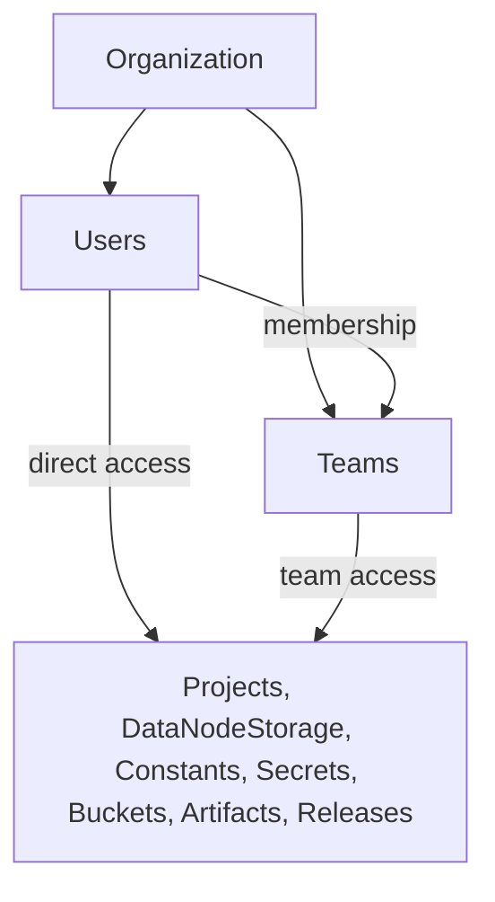

# Users and Access

Main Sequence is built for shared work. Projects, datasets, dashboards, constants, secrets, artifacts, and releases are rarely useful for only one person.

That means access control is not an optional admin topic. It is part of how teams build and operate on the platform.

This guide explains the access model in plain language, without implementation details.

For notification delivery rules and client usage, see [Notifications](notifications.md).

## Start with the right mental model

There are five concepts to keep separate:

1. `Organization`: the tenant boundary
2. `User`: a person who signs in to the platform
3. `Role`: a broad level of responsibility inside the organization
4. `Team`: a reusable group you can share resources with
5. Resource sharing: the explicit grants that decide who can view or edit a specific resource

Most access questions can be reduced to:

- which organization does this belong to
- who is the user
- does the user have a broad admin role
- was the resource shared directly to the user
- was the resource shared to a team the user belongs to

## How the pieces fit together

## Organization

The organization is the main security boundary.

In practice, that means:

- users belong to one organization
- teams belong to one organization
- shared resources are usually visible only inside that organization
- access is designed around collaboration inside the same tenant, not across tenants

This is why the first access question is usually not "what role does this person have?" but "are they even in the same organization?"

## User

A user is the person operating on the platform.

Users are the identities that:

- sign in
- create resources
- run commands through the CLI
- receive direct access to resources
- belong to one or more teams

When you share a resource directly to a user, you are saying:

> this specific person should be able to see or edit this specific thing

That is the most explicit form of access.

## Roles

Roles are the broad, organization-level classification of what kind of platform user someone is.

For most practical workflows, the important roles are:

- `Organization Admin`
- `Dev User`
- `Light User`

Use roles to think about broad responsibility:

- who can administer the organization
- who is expected to build and maintain workflows
- who mostly consumes outputs

Do not use roles as your mental model for day-to-day sharing.

Why:

- roles are coarse
- real collaboration usually happens at the resource level
- two users with the same broad role may still need access to very different projects, tables, or dashboards

So the safe rule is:

- roles define broad responsibility
- sharing defines actual resource access

## Teams

Teams are reusable sharing groups inside one organization.

Use a team when the same set of people should repeatedly receive access to the same class of resources.

Examples:

- `Research`
- `Platform`
- `Risk`
- `Execution`
- `Client Reporting`

Teams are useful because they let you share once and reuse that decision many times.

Instead of sharing ten dashboards and five datasets to five people one by one, you can share them to one team and manage membership there.

## What team membership means

If a user belongs to a team, they inherit access for resources that were shared to that team.

That is the core idea.

Membership means:

- the user is part of that team for access purposes
- the user receives inherited access to resources shared to that team

Membership does not automatically mean:

- the user can manage the team
- the user can change who else is in the team
- the user can change the team's sharing rules
- the user can administer every resource the team can see

That distinction matters a lot.

Being inside a team means the user benefits from the team's access. It does not automatically make them an administrator of the team itself.

## Resource sharing

Main Sequence uses explicit sharing for important resources.

That is the practical layer that answers:

- who can read this resource
- who can edit this resource

This model appears across resources such as:

- `Project`
- `DataNodeStorage`
- `Constant`
- `Secret`
- `Bucket`
- `Artifact`
- `ResourceRelease`

The same pattern shows up again and again:

- some users can view
- some users can edit
- access may come directly or through a team

## Direct access vs team access

There are two common ways a user gets access to a resource.

### Direct access

The resource is shared straight to a user.

Use this when:

- the access is personal
- the resource is unusual or one-off
- you do not want to create or reuse a team for it

### Team access

The resource is shared to a team, and all current team members inherit that access.

Use this when:

- several people need the same access
- access should stay aligned as people join or leave the team
- you want one reusable access boundary instead of many manual grants

## View vs edit

Most of the time, the practical distinction is simple:

- `view`: can consume or inspect the resource
- `edit`: can modify, maintain, or administer the resource

For example:

- on a `DataNodeStorage`, `view` means reading the published dataset
- on a `DataNodeStorage`, `edit` means maintaining or administrating the published dataset
- on a dashboard release, `view` means opening it
- on a constant, `edit` means changing the runtime value

This is the cleanest engineering split:

- readers get `view`
- maintainers get `edit`

## The subtle but important rule about teams

This is the part people most often get wrong:

> a team can be used as a principal for sharing, but being a member of the team does not automatically make you an administrator of the team itself

In other words:

- if a dataset is shared to `Research`, members of `Research` inherit access to that dataset
- that does not automatically mean every member of `Research` can manage the `Research` team

This is why "team membership" and "team administration" should be thought of as separate concerns.

## Practical examples

### Example 1: Share a dataset to a team

If a `DataNodeStorage` is shared to `Research` with `view` access:

- current members of `Research` can read the dataset
- future members of `Research` will also inherit that read access
- removing someone from `Research` removes that inherited path

### Example 2: Give one person direct edit access

If one workflow maintainer needs to manage a dataset directly:

- share the `DataNodeStorage` to that user with `edit`
- do not widen access for the whole team unless that is actually intended

### Example 3: Team membership is not team administration

If Alice is a member of `Research`:

- Alice inherits access for resources shared to `Research`
- Alice does not automatically become responsible for changing `Research` membership
- Alice does not automatically become responsible for changing `Research` sharing rules

### Example 4: Team-based edit does not mean unlimited control

If `Team A` has `edit` access to a dashboard or dataset:

- members of `Team A` can use that edit path on that resource
- that does not automatically mean they can change every access rule everywhere else on the platform

Keep your thinking resource by resource.

## How this connects to the tutorial

In the tutorial, you already saw this pattern in practice:

- `DataNodeStorage` controls access to published data
- `Constant` and `Secret` control access to runtime configuration
- `Bucket` and `Artifact` control access to stored files
- `ResourceRelease` controls access to deployed experiences such as dashboards and agents

That is why RBAC appears early in the Main Sequence workflow. The moment a resource becomes useful to other people, access design becomes part of the engineering work.

## Rules of thumb

- start with the organization boundary first
- use roles for broad responsibility, not detailed sharing
- use teams for repeatable access patterns
- use direct sharing for exceptional or personal cases
- keep `view` and `edit` separate whenever possible
- do not assume team membership means team administration
- think in terms of resource boundaries: project, dataset, secret, bucket, artifact, release

For the CLI workflow around sharing specific resources, see [Role-Based Access Control Tutorial](../../tutorial/role_based_access_control.md) and [Constants and Secrets](./constants_and_secrets.md).
