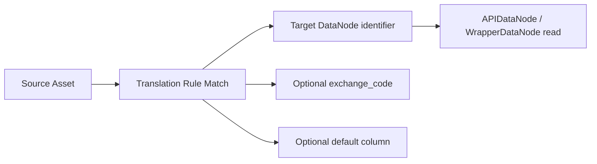

# Translation Tables

Translation tables are the routing layer between assets and upstream market data.

They answer a simple but important question:

> for this asset, which time series should the platform read?

That sounds small, but it solves a real structural problem in markets systems:

- the asset you trade is not always the same object as the asset used by the upstream price source
- one portfolio may need prices from more than one upstream `DataNode`
- different asset types may need different data sources, exchanges, or default price columns

Translation tables let you describe that mapping as data instead of hard-coding it into one node.

## Why they exist

Imagine a portfolio that trades:

- US equities
- crypto
- custom fixed-income instruments

Those assets may not all read from the same upstream table.

You might want:

- equities -> `alpaca_1d_bars`
- crypto -> `binance_1d_bars`
- mock bonds -> `simulated_daily_closes_tutorial`

Without a translation table, you would have to hard-code routing logic inside your dependency layer.

With a translation table, the rule becomes explicit, inspectable, and reusable.

## The mental model

A translation table is an organization-scoped object with:

- one `unique_identifier`
- a set of rules

Each rule says:

- which assets it applies to
- which upstream time series identifier should be used
- optionally which exchange listing should be selected
- optionally which value column should be treated as the default

In practice, the flow looks like this:



## The core objects

At the client level, the important types are:

- `msc.AssetFilter`
- `msc.AssetTranslationRule`
- `msc.AssetTranslationTable`

### `AssetFilter`

This decides whether a rule applies to an asset.

Common fields include:

- `security_type`
- `security_market_sector`

Example:

```python
msc.AssetFilter(
    security_type="MOCK_ASSET",
)
```

### `AssetTranslationRule`

This is one routing rule.

Important fields:

- `asset_filter`
- `markets_time_serie_unique_identifier`
- `target_exchange_code`
- `default_column_name`

Example:

```python
msc.AssetTranslationRule(
    asset_filter=msc.AssetFilter(security_type="MOCK_ASSET"),
    markets_time_serie_unique_identifier="simulated_daily_closes_tutorial",
    default_column_name="close",
)
```

### `AssetTranslationTable`

This is the table of rules itself.

Important points:

- `unique_identifier` is organization-scoped
- the table is reusable across projects
- rules should be mutually exclusive

## The most important invariant: exactly one rule must match

Translation tables are not best-effort routing.

They are deterministic routing.

For any asset being evaluated:

- `0` matching rules is an error
- `>1` matching rules is an error
- exactly `1` matching rule is valid

This is one of the most important business rules to remember.

Why it matters:

- no match means the platform does not know where to get prices
- multiple matches means the routing is ambiguous

So the design goal is not "a reasonable rule probably matches." The design goal is "exactly one rule matches every asset you care about."

!!! warning "Important"
    Translation tables should be designed so rules are mutually exclusive for the asset universe you actually use.

## What a rule really returns

When a translation rule matches, the SDK effectively gets back a routing instruction with:

- `markets_time_serie_unique_identifier`
- `exchange_code`
- `default_column_name_from_rule`

That means a translation table does more than point to a table name.

It can also say:

- which share-class listing to use
- which column is the default valuation field

## Share classes and `target_exchange_code`

This is the part that matters when the same economic asset may exist on multiple listings.

If the upstream source has several listings for the same ticker group, the routing can become ambiguous.

That is what `target_exchange_code` is for.

Use it when:

- the same asset family has multiple exchange listings
- the upstream bars source needs an explicit exchange constraint
- you want deterministic share-class selection

If you do not constrain the listing when multiple valid targets exist, wrapper-based reads can fail because the target mapping is ambiguous.

## Why translation tables are more than a matching ruleset

This is the subtle point many readers miss.

When you build a `WrapperDataNode` from a translation table, the SDK does not wait until each asset is evaluated to discover dependencies.

It first resolves every distinct `markets_time_serie_unique_identifier` referenced by the table into an upstream reader.

That means the translation table also behaves like a dependency manifest.

Practical consequence:

- if one rule points to a deleted or invalid table
- wrapper construction can fail immediately
- even if the assets in your current run would never use that bad rule

This is why shared translation tables are powerful, but they also need discipline.

!!! tip "Rule of thumb"
    If a translation table is only meant for one tutorial or one isolated project, give it its own dedicated `unique_identifier` and keep its rules narrow.

## A worked tutorial-style example

This is the same pattern used in the portfolio tutorial.

You have:

- custom assets with `security_type="MOCK_ASSET"`
- a prices `DataNode` with identifier `simulated_daily_closes_tutorial`

You can wire them together like this:

```python
translation_table = msc.AssetTranslationTable.get_or_create(
    translation_table_identifier="prices_translation_table_1d",
    rules=[
        msc.AssetTranslationRule(
            asset_filter=msc.AssetFilter(
                security_type="MOCK_ASSET",
            ),
            markets_time_serie_unique_identifier="simulated_daily_closes_tutorial",
            default_column_name="close",
        ),
    ],
)
```

What this means:

- every asset whose `security_type` is `MOCK_ASSET`
- should read prices from `simulated_daily_closes_tutorial`
- and should treat `close` as the default value column

## How VFB uses translation tables

In Virtual Fund Builder, translation tables are usually referenced through:

- `PricesConfiguration.translation_table_unique_id`

That is how VFB knows how to map the portfolio asset universe into the upstream price source.

This is why the price configuration and the signal universe must agree.

If the signal emits asset `unique_identifier` values that do not line up with the translation table logic, the portfolio can fail in ways that look like a pricing problem but are really a routing problem.

## When you should use a translation table

Use one when:

- different asset types should route to different price tables
- the traded asset and the upstream priced asset are not exactly the same object
- the routing logic should be explicit and reusable
- you want a clean separation between business routing rules and node code

You probably do not need one when:

- every asset always reads from the same upstream table
- the mapping is trivial and not expected to evolve
- the code path is a small one-off experiment

## CLI inspection

You can inspect translation tables from the CLI:

```bash
mainsequence markets asset-translation-table list
mainsequence markets asset-translation-table detail <TABLE_ID>
```

The detail view renders each rule as a readable `match => target` mapping, which is the fastest way to check what the table is actually doing.

## Common mistakes

### 1. Overlapping rules

Example:

- one rule matches `security_market_sector="Equity"`
- another rule matches `security_type="COMMON STOCK"`

That can be fine in theory, but if one asset satisfies both, the routing becomes ambiguous.

### 2. Rules that match nothing

A rule that never matches is usually a sign that:

- the asset metadata is wrong
- the filter is too narrow
- the routing logic drifted from the real asset universe

### 3. Shared table with stale targets

If one old rule still points to a removed upstream table, wrapper initialization can fail even when the current workflow would not use that rule.

### 4. Mixing tutorial and production routing in one table

That often makes debugging harder than it needs to be.

Use a dedicated translation-table identifier for tutorial or experimental flows.

### 5. Forgetting exchange specificity

If multiple listings exist and you need one specific listing, `target_exchange_code` is not optional.

## Design advice

- keep rules simple
- make rules mutually exclusive
- prefer dedicated tables for isolated projects or tutorials
- treat the table identifier as a real, named configuration object
- review translation tables the same way you review dependency wiring

## Related reading

- [Assets](./assets.md)
- [Prices and Forward Fill](../virtualfundbuilder/prices_and_forward_fill.md)
- [Portfolio Pipeline and Configuration](../virtualfundbuilder/portfolio_pipeline.md)
- [Part 4.3 — Markets — Portfolios and Virtual Funds](../../tutorial/virtualfundbuilder/markets_portfolios_and_virtual_funds.md)
