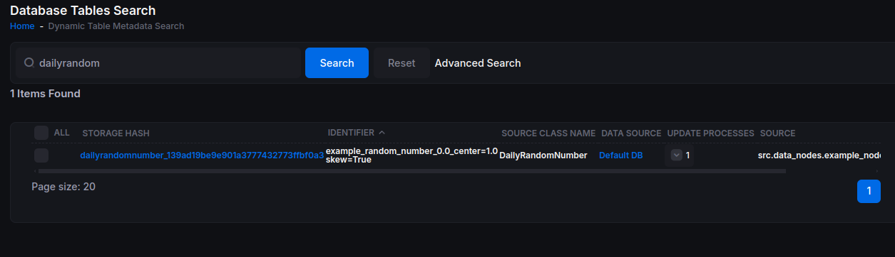
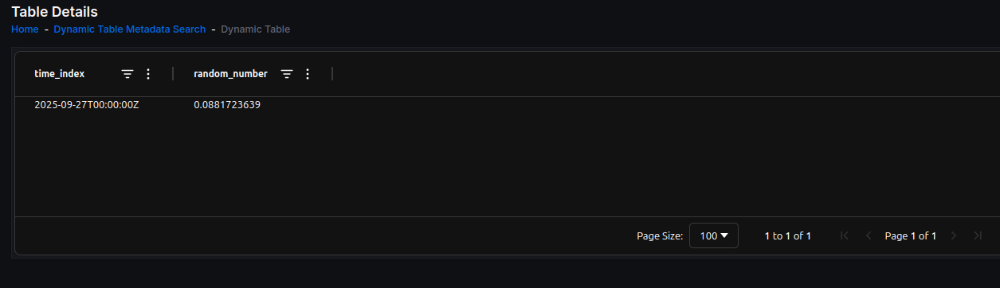
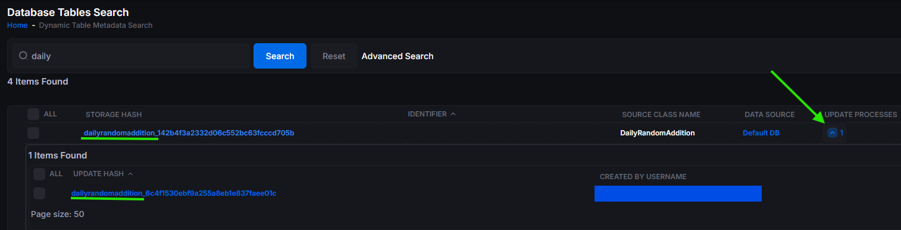
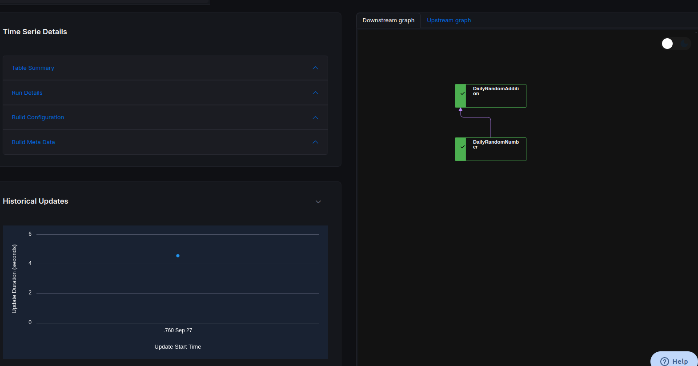
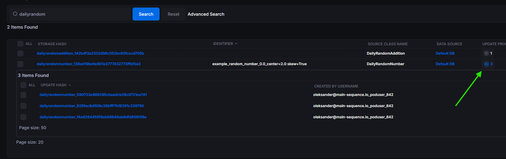

# Creating a Data Node (Part 2)

## 2. Creating a Data Node

**Key concepts:** data DAGs, `DataNode`, dependencies, `update_hash`, and `storage_hash`.

Main Sequence encourages you to model workflows as data DAGs (directed acyclic graphs), composing your work into small steps called **data nodes**, each performing a single transformation.

Create a new file at `src\data_nodes\example_nodes.py` (Windows) or `src/data_nodes/example_nodes.py` (macOS/Linux), and define your first node, `DailyRandomNumber`, by subclassing `DataNode`.


```python
from typing import Dict, Union

import pandas as pd

from mainsequence.tdag.data_nodes import DataNode, APIDataNode
import mainsequence.client as msc
import numpy as np
from pydantic import BaseModel, Field


class VolatilityConfig(BaseModel):
    center: float = Field(
        ...,
        title="Standard Deviation",
        description="Standard deviation of the normal distribution (must be > 0).",
        examples=[0.1, 1.0, 2.5],
        gt=0,  # constraint: strictly positive
        le=1e6,  # example upper bound (optional)
        multiple_of=0.0001,  # example precision step (optional)
    )
    skew: bool


class RandomDataNodeConfig(BaseModel):
    mean: float = Field(..., ignore_from_storage_hash=False, title="Mean",
                        description="Mean for the random normal distribution generator")
    std: VolatilityConfig = Field(VolatilityConfig(center=1, skew=True), ignore_from_storage_hash=True,
                                  title="Vol Config",
                                  description="Vol Configuration")


class DailyRandomNumber(DataNode):
    """
    Example Data Node that generates one random number every day
    """

    def __init__(self, node_configuration: RandomDataNodeConfig, *args, **kwargs):
        """
        :param node_configuration: Configuration containing mean and std parameters
        :param kwargs: Additional keyword arguments
        """
        self.node_configuration = node_configuration
        self.mean = node_configuration.mean
        self.std = node_configuration.std
        super().__init__(*args, **kwargs)

    def get_table_metadata(self) -> msc.TableMetaData:
        TS_ID = f"example_random_number_{self.mean}_{self.std}"
        meta = msc.TableMetaData(identifier=TS_ID,
                                description="Example Data Node")

        return meta

    def update(self) -> pd.DataFrame:
        """Draw daily samples from N(mean, std) since last run (UTC days)."""
        today = pd.Timestamp.now("UTC").normalize()
        last = self.update_statistics.max_time_index_value
        if last is not None and last >= today:
            return pd.DataFrame()
        return pd.DataFrame(
            {"random_number": [np.random.normal(self.mean, self.std.center)]},
            index=pd.DatetimeIndex([today], name="time_index", tz="UTC"),
        )

    def dependencies(self) -> Dict[str, Union["DataNode", "APIDataNode"]]:
        """
        This node does not depend on any other data nodes.
        """
        return {}
```

### DataNode Recipe

To create a data node we must follow the same recipe every time:

1. Extend the base class `mainsequence.tdag.DataNode`
2. Implement the constructor method `__init__()`
3. Implement the `dependencies()` method
4. Implement the `update()` method

#### The update() Method

The update method has only one requirement: it should return a `pandas.DataFrame` with the following characteristics:

* Update method always needs to return a `pd.DataFrame()`
##### Data Frame Structure Requirements
* The first index level must always be of type `datetime.datetime(timezone="UTC")`.
* All column names in the DataFrame must be lowercase and no more than 63 characters long.
* Column data types are only allowed to be `float`, `int`, or `str`. Any date information must be transformed to `int` or `float`.
* The DataFrame must not be empty. If there is no new data to return, an empty `pd.DataFrame()` must be returned.
* A MultiIndex DataFrame is only allowed when the first index level is of type `datetime.datetime(timezone="UTC")`, the second index level is of type `str`, and its name is `unique_identifier`.
* For a single-index DataFrame, the index must not contain duplicate values. For a MultiIndex DataFrame, there must be no duplicate combinations of `(time_index, unique_identifier)`.
* The name of the first index level must always be `time_index`, and it is strongly recommended that it represents the observation time of the time series. For example, if the DataFrame stores time bars, `time_index` should represent the moment the bar is observed, not when the bar started.
* If dates are stored in columns, they must be represented as timestamps.


Next, create `scripts\random_number_launcher.py` to run the node:

```python
from src.data_nodes.example_nodes import DailyRandomNumber

def main():
    daily_node = DailyRandomNumber(node_configuration=RandomDataNodeConfig(mean=0.0))
    daily_node.run()

if __name__ == "__main__":
    main()
```

To run and debug in VS Code, you can configure a launch file at `.vscode\launch.json`:

you can also just as copilot or your ai assitant

```text
Build me a debug launcher called "Debug random_number_launcher" 
for my file src/random_number_launcher
```


**Windows:**
```json
{
    "version": "0.2.0",
    "configurations": [
        {
            "name": "Debug random_number_launcher",
            "type": "debugpy",
            "request": "launch",
            "program": "${workspaceFolder}\\scripts\\random_number_launcher.py",
            "console": "integratedTerminal",
            "env": {
                "PYTHONPATH": "${workspaceFolder}"
            },
            "python": "${workspaceFolder}\\.venv\\Scripts\\python.exe"
        }
    ]
}
```

**macOS/Linux:**
```json
{
    "version": "0.2.0",
    "configurations": [
        {
            "name": "Debug random_number_launcher",
            "type": "debugpy",
            "request": "launch",
            "program": "${workspaceFolder}/scripts/random_number_launcher.py",
            "console": "integratedTerminal",
            "env": {
                "PYTHONPATH": "${workspaceFolder}"
            },
            "python": "${workspaceFolder}/.venv/bin/python"
        }
    ]
}
```

Back to your `random_number_launcher.py`, and at the top right corner of VS Code you will see **Run Python File** dropdown, click on the **Python Debugger: Debug using launch.json** option and finally select the debug configuration you just created.

This will execute the configuration. Then open:

https://main-sequence.app/dynamic-table-metadatas/

Search for `dailyrandom`. You should see your data node and its table.



Click the **storage hash**, then in the table's context menu (the **…** button), select **Explore Table Data** to confirm that your node persisted data.



### Add a Dependent Data Node

Now extend the workflow with a node that depends on `DailyRandomNumber`. Add the following to `src\data_nodes\example_nodes.py`:

```python
class DailyRandomAddition(DataNode):
    def __init__(self, mean: float, std: float, *args, **kwargs):
        self.mean = mean
        self.std = std
        self.daily_random_number_data_node = DailyRandomNumber(
            *args, node_configuration=RandomDataNodeConfig(mean=0.0), **kwargs
        )
        super().__init__(*args, **kwargs)

    def dependencies(self):
        return {"number_generator": self.daily_random_number_data_node}

    def update(self) -> pd.DataFrame:
        """Draw daily samples from N(mean, std) since last run (UTC days)."""
        today = pd.Timestamp.now("UTC").normalize()
        last = self.update_statistics.max_time_index_value
        if last is not None and last >= today:
            return pd.DataFrame()
        random_number = np.random.normal(self.mean, self.std)
        dependency_noise = self.daily_random_number_data_node.get_df_between_dates(
            start_date=today, great_or_equal=True
        ).iloc[0]["random_number"]
        self.logger.info(f"random_number={random_number} dependency_noise={dependency_noise}")

        return pd.DataFrame(
            {"random_number": [random_number + dependency_noise]},
            index=pd.DatetimeIndex([today], name="time_index", tz="UTC"),
        )
```

This simply defines a **dependent** node (`DailyRandomAddition`) that references and uses the output of `DailyRandomNumber`.

Create a launcher at `scripts\random_daily_addition_launcher.py`:

```python
from src.data_nodes.example_nodes import DailyRandomAddition


daily_node = DailyRandomAddition(mean=0.0, std=1.0)
daily_node.run(debug_mode=True, force_update=True)
```

Now to run this launcher, add a new debug configuration to your `.vscode/launch.json` in `configurations` list (or duplicate the existing config and change the program path and name).


(Windows): 
```json
        {
            "name": "Debug random_daily_addition_launcher",
            "type": "debugpy",
            "request": "launch",
            "program": "${workspaceFolder}\\scripts\\random_daily_addition_launcher.py",
            "console": "integratedTerminal",
            "env": {
                "PYTHONPATH": "${workspaceFolder}"
            },
            "python": "${workspaceFolder}\\.venv\\Scripts\\python.exe"
        }
```
(macOS/Linux): 
```json
{ 
            "name": "Debug random_daily_addition_launcher", 
            "type": "debugpy", 
            "request": "launch", 
            "program": "${workspaceFolder}/scripts/random_daily_addition_launcher.py", 
            "console": "integratedTerminal", 
            "env": { 
                "PYTHONPATH": "${workspaceFolder}" 
            }, 
            "python": "${workspaceFolder}/.venv/bin/python" 
        }
```
Then back to the `random_daily_addition_launcher.py` file and run the configuration from the Run/Debug dropdown at the top-right, choose "Debug random_daily_addition_launcher” and then choose new configuration with "Debug random_daily_addition_launcher" name. After it runs, return to the Dynamic Table Metadatas page to see the new table:

https://main-sequence.app/dynamic-table-metadatas/?search=dailyrandom&storage_hash=&identifier=

Open the `dailyrandomaddition_XXXXX` table to explore it. For a visual of the dependency structure, click the **update process** arrow and then the **update hash**.



You'll see the dependency graph for this workflow:



## 4. `update_hash` vs. `storage_hash`

A `DataNode` does two critical things in Main Sequence:

1. Controls the **update process** for your data (sequential or time-series based).  
2. Persists data in the **Data Engine** (think of it as a managed database—no need to handle schemas, sessions, etc.).

To support both, each `DataNode` uses two identifiers:

- **`update_hash`**: a unique hash derived from the combination of arguments that define an update process. In the random-number example, that might include `mean` and `std`.
- **`storage_hash`**: an identifier for where data is stored. It can ignore specific arguments so multiple update processes can write to the **same** table.

Why do this? Sometimes you want to store data from different processes in a single table. While the simple example here is contrived, this pattern becomes very useful with multi-index tables.

Now update your **daily random number launcher** to run two update processes with different volatility configurations but the **same** storage. 

To do this, modify `scripts\random_number_launcher.py` to be as follows:

```python
from src.data_nodes.example_nodes import DailyRandomNumber, RandomDataNodeConfig, VolatilityConfig

low_vol = VolatilityConfig(center=0.5, skew=False)
high_vol = VolatilityConfig(center=2.0, skew=True)


daily_node_low = DailyRandomNumber(node_configuration=RandomDataNodeConfig(mean=0.0, std=low_vol))
daily_node_high = DailyRandomNumber(
    node_configuration=RandomDataNodeConfig(mean=0.0, std=high_vol)
)

daily_node_low.run(debug_mode=True, force_update=True)
daily_node_high.run(debug_mode=True, force_update=True)
```

Here we create two `DailyRandomNumber` nodes with different `std` (Volatility) configurations but the same `mean`. Since we set `ignore_from_storage_hash=True` for the `std` field in `RandomDataNodeConfig`, both nodes will write to the same underlying table.

Run the updated launcher in VS Code as before. After it runs, return to the Dynamic Table Metadatas page to see the table for `DailyRandomNumber`.

You'll see that you have a single table with three different update processes (you just added two new processes by running the modified launcher):



Congratulations! You've built your first Data Nodes in Main Sequence. In the next part of the tutorial, we'll explore scheduling and automating these nodes and more.
