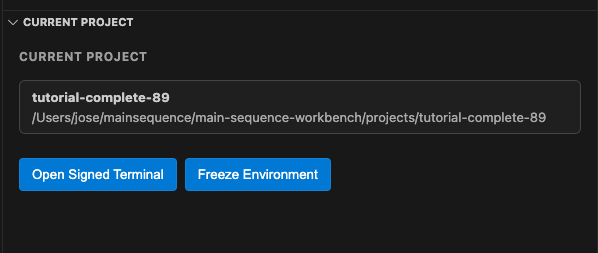
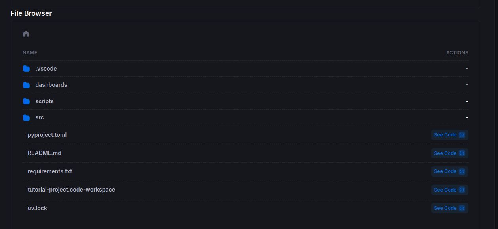
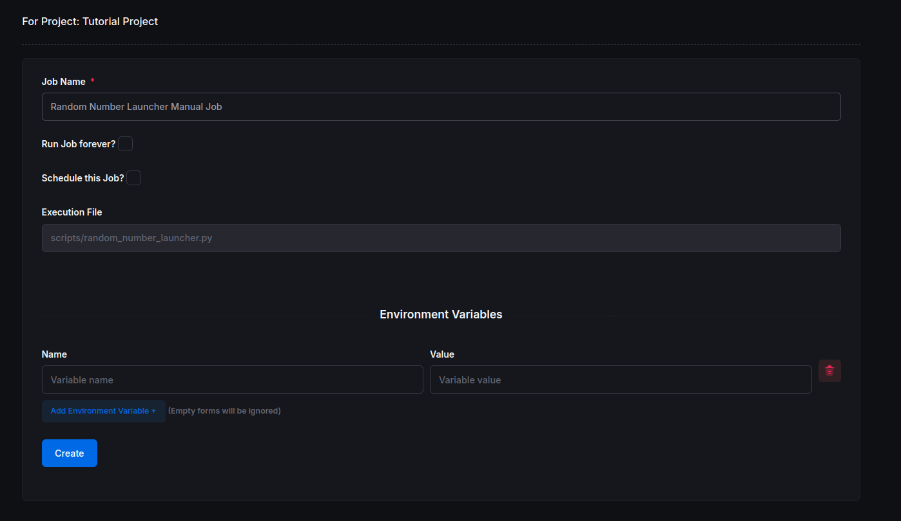
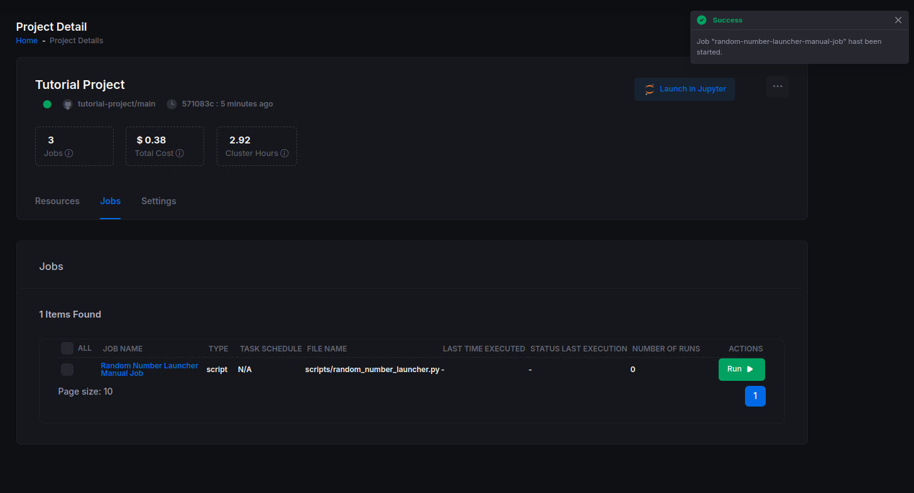
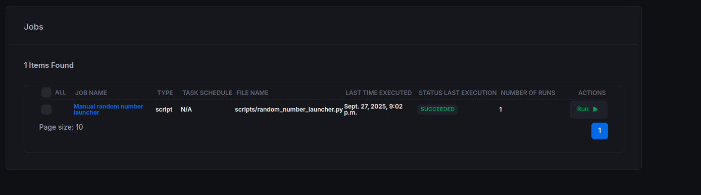
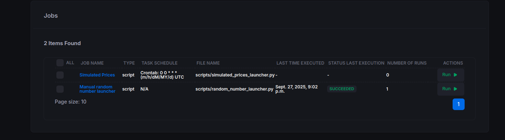

# Part 4: Orchestration

Now that you've built and tested your `DataNode`s locally, it's time to orchestrate them on the Main Sequence Platform.

## Quick Summary

In this part, you will:

- sync local project changes to the platform from the CLI
- create manual jobs from both GUI and CLI
- freeze jobs to project images for reproducible execution
- define recurring schedules as code (`project_configuration.yaml`)

DataNodes created in this part: **none new** (you orchestrate DataNodes built in previous parts).

This tutorial keeps the **GUI flow** and adds the equivalent **CLI flow** next to it. The GUI is useful for discovery. The CLI is faster when you want a repeatable workflow that you can document, automate, or run in CI.

## Before You Start

Before creating or running jobs, make sure your CLI session is active and you are already in the project root directory.

```bash
cd /path/to/your/project
mainsequence login you@company.com
mainsequence project refresh_token
mainsequence project current
mainsequence project jobs --help
```

- `mainsequence project current` should show the expected project id and local path.
- All CLI examples below assume your current working directory is the repository root for the tutorial project.
- If you are running commands from another directory, add `--path /path/to/project` where needed.
- If a command says you are not logged in, run `mainsequence login <email>` again.
- If `mainsequence project jobs` is missing, update or reinstall the CLI/SDK so your installed command set matches the current documentation.
- The commands shown below work in `bash`, `zsh`, and PowerShell. The command text is the same even if your shell prompt looks different.

## 1) Update Your Environment

Before scheduling anything, make sure your environment is consistent and your latest changes are committed.

1. **Run a dry-run first (recommended)** to preview everything the sync command will do:

   ```bash
   mainsequence project sync -m "Tutorial files" --dry-run
   ```

2. **Run the full sync workflow**:

   ```bash
   mainsequence project sync -m "Tutorial files"
   ```

   You can also target by project id:

   ```bash
   mainsequence project sync [PROJECT_ID] -m "Tutorial files"
   ```

3. **What `mainsequence project sync` does for you**

   - Ensures your local `.venv` and `uv` tooling are ready.
   - Bumps the package version (`patch` by default; configurable with `--bump`).
   - Runs `uv lock` and `uv sync`.
   - Exports locked dependencies to `requirements.txt`.
   - Runs `git add -A`, creates your commit, and pushes to remote (unless `--no-push` is used).
   - Uses your project SSH key setup for secure push flow.

4. **Useful options**

   ```bash
   # Bump minor version instead of patch
   mainsequence project sync -m "Tutorial files" --bump minor

   # Commit changes but skip push
   mainsequence project sync -m "Tutorial files" --no-push
   ```

5. **GUI alternative**

   You can still use the VS Code extension button to compile and freeze dependencies if you prefer:

   

## 2) Scheduling Jobs

You can run jobs **manually** or **automatically** on a schedule.

### 2.1 Manual Run

#### GUI

1. Open your Tutorial Project:  
   <https://main-sequence.app/projects/?search=tutorial>

2. In the file browser, navigate to the project. It should look similar to:



3. Click the **scripts** folder and select **Create Job +** on any of the launcher scripts. Name it, for example, **Random Number Launcher - Manual Job**.



4. After creation, the job will appear under the **Jobs** tab. Because it is not scheduled, nothing has run yet. Click **Run** to execute it manually.

You will see a confirmation toast in the top-right corner:



5. Click the job to view its **Job Runs**. Wait for the run to complete to see the results.



#### CLI

You can create the same manual job from the terminal.

1. Create an unscheduled job:

   ```bash
   mainsequence project jobs create --name "Random Number Launcher - Manual Job" --execution-path scripts/random_number_launcher.py
   ```

   Notes:

   - `execution-path` must be relative to the repository root, for example `scripts/random_number_launcher.py`.
   - If the CLI asks whether to build a schedule, answer **No** for a manual job.
   - If project images already exist, the CLI may prompt you to select a `related_image_id`.
   - If you want to run the Part 3 example instead, replace the execution path with `scripts/simulated_prices_launcher.py`.

2. List the jobs for the current project and note the job id:

   ```bash
   mainsequence project jobs list
   ```

3. Trigger the job manually:

   ```bash
   mainsequence project jobs run <JOB_ID>
   ```

4. Inspect run history:

   ```bash
   mainsequence project jobs runs list <JOB_ID>
   ```

5. Stream logs for a specific run:

   ```bash
   mainsequence project jobs runs logs <JOB_RUN_ID> --max-wait-seconds 900
   ```

### 2.2 Frozen Jobs with Images

One important concept in building strong systems is being able to guarantee that they will run even when you modify the repository later. To do that, you can freeze a job against a project image. This image captures a pushed commit plus the selected base image, so the job can keep running the same way even if the repository changes afterward.

All project images are stored at the project level in the **Images** tab.

#### GUI

Use the **Images** tab to review the images already created for the project and select one when creating jobs that must stay pinned to a known environment.

#### CLI

1. List existing project images:

   ```bash
   mainsequence project images list
   ```

2. Create a new project image when needed:

   ```bash
   mainsequence project images create
   ```

   Notes:

   - The CLI will show pushed commits and may prompt you for `project_repo_hash` if you do not pass one explicitly.
   - Only commits that already exist on the remote can be used to build an image.
   - If the image takes time to build, increase the wait window if needed, for example:

   ```bash
   mainsequence project images create --timeout 600 --poll-interval 15
   ```

3. Create a job pinned to that image:

   ```bash
   mainsequence project jobs create --name "Random Number Launcher - Frozen Image" --execution-path scripts/random_number_launcher.py --related-image-id <IMAGE_ID>
   ```

4. Verify the job and image linkage:

   ```bash
   mainsequence project jobs list
   mainsequence project images list
   ```

### 2.3 Automatic Schedule

As projects and workflows grow, you will usually want **automation described as code**. You can define jobs and schedules inside the repository and let the platform apply them from version-controlled configuration.

Create a file named **`project_configuration.yaml`** at the **repository root**.

**Windows path example:** `C:\Users\<YourName>\mainsequence\<YourOrganization>\projects\tutorial-project\project_configuration.yaml`

**macOS/Linux path example:** `/home/<YourName>/mainsequence/<YourOrganization>/projects/tutorial-project/project_configuration.yaml`

Add the following content to schedule `simulated_prices_launcher.py` to run daily at midnight:

```yaml
name: "Tutorial Job Configuration"
jobs:
  - name: "Simulated Prices"
    resource:
      script:
        path: "scripts/simulated_prices_launcher.py"
    schedule:
      type: "crontab"
      expression: "0 0 * * *"
```

**Note:** In the YAML file, always use forward slashes (`/`) for the script path, even on Windows. The platform will handle path conversion automatically.

#### GUI / Git-assisted path

If you want to follow the same signed-terminal flow used earlier in the tutorial, commit and push this file with a signed terminal:

```bash
mainsequence project open-signed-terminal [PROJECT_ID]
```

**Note:** Replace `[PROJECT_ID]` with your actual project id (for example, `60`).

Then, in the new terminal window that opens, run:

```bash
git add project_configuration.yaml
git commit -m "Add automated job schedule"
git push
```

The platform will detect the file and create the scheduled job automatically:



#### CLI

The recommended CLI flow is to keep the schedule in `project_configuration.yaml` and let `mainsequence project sync` handle the environment update, commit, and push:

```bash
mainsequence project sync -m "Add automated job schedule"
```

After the sync completes, verify that the scheduled job exists:

```bash
mainsequence project jobs list
```

Once the scheduler has triggered the job, inspect runs and logs:

```bash
mainsequence project jobs runs list <JOB_ID>
mainsequence project jobs runs logs <JOB_RUN_ID> --max-wait-seconds 900
```

#### CLI direct-create alternative

If you want to create a scheduled job directly from the terminal without relying on `project_configuration.yaml`, you can do that too:

```bash
mainsequence project jobs create --name "Simulated Prices" --execution-path scripts/simulated_prices_launcher.py --schedule-type crontab --schedule-expression "0 0 * * *"
```

This direct CLI approach is useful for quick experiments. For shared projects, the repository-based `project_configuration.yaml` flow is usually better because the schedule stays reviewable and version-controlled.

For a deeper explanation of jobs, schedules, images, runs, and the Python client, see [Scheduling Jobs](../knowledge/infrastructure/scheduling_jobs.md).
