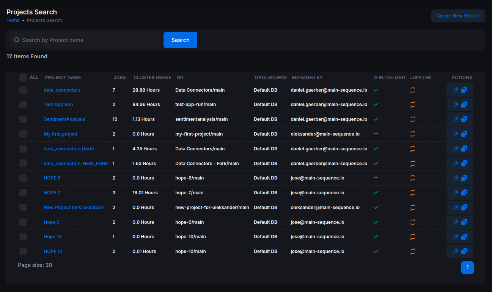
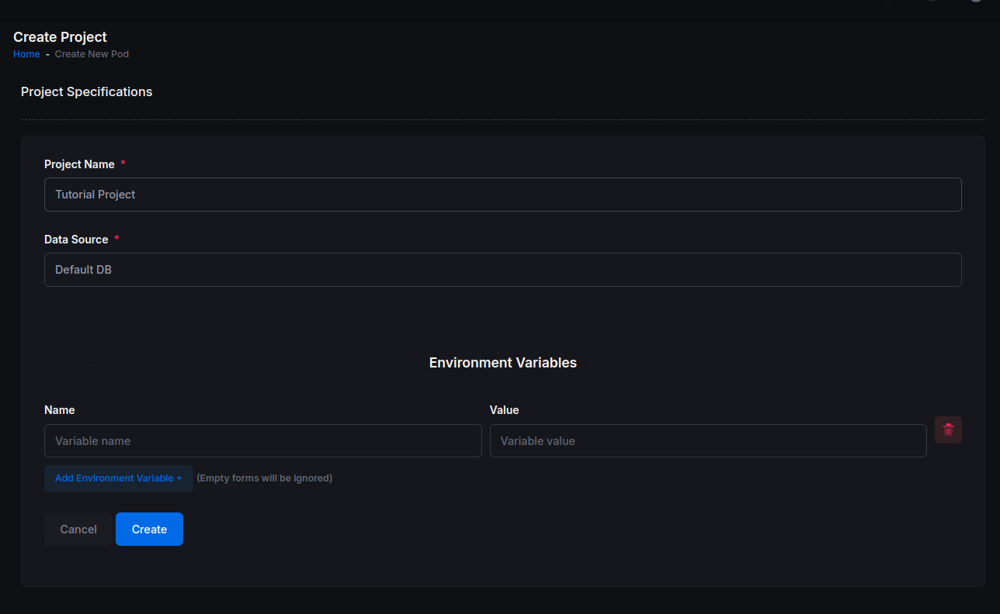
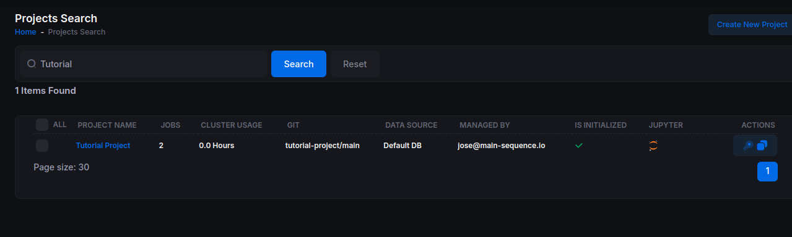
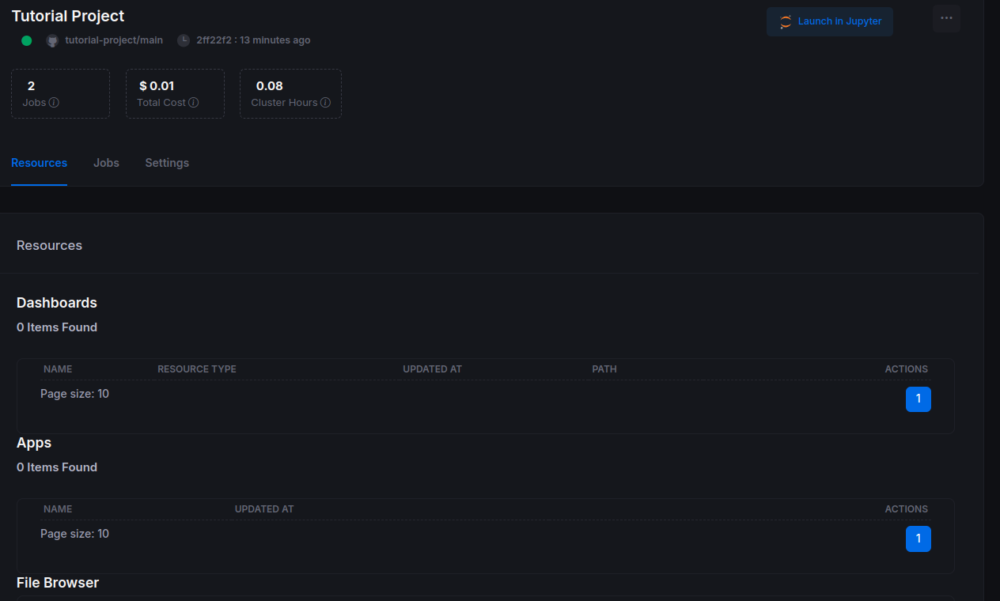
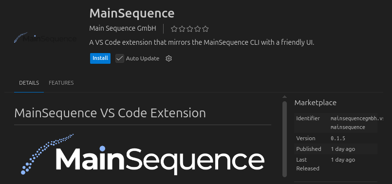
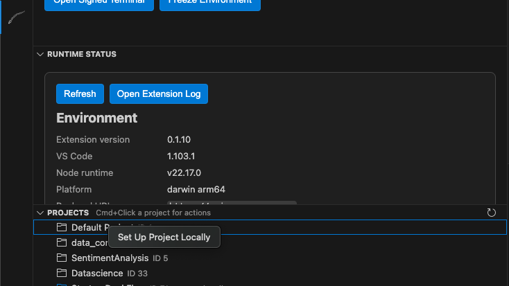
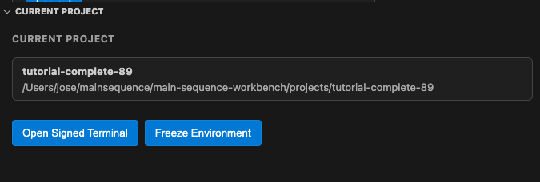

# Introduction

If you are building a pricing engine, a research pipeline, or a dashboard, the real bottleneck is usually not code. It is infrastructure: repositories, environments, storage, compute, permissions, and deployment.

Main Sequence is designed to remove that bottleneck. A project gives you a production-ready workspace where code, data, and compute are already connected, so your team can move from idea to business value faster.

In this tutorial, you will create a project using the platform UI and set it up locally with the VS Code extension.

## Quick Summary

In this part, you will:

- create a project in the Main Sequence web app
- install and use the VS Code extension
- map the project locally and open it in VS Code
- verify project readiness before coding

DataNodes created in this part: **none**.

## Setting a Project (Part 1 - GUI + VS Code Extension)

This guide uses the web application and the VS Code extension flow.
If you prefer the terminal-only flow, see [Setting a Project (CLI)](./setting_a_project.md).

## 1. Create a Project (GUI)

Log in to Main Sequence. You will land on the **Projects** page. Projects help you organize work, data, and compute. Create your first one: click **Create New Project** and name it **Tutorial Project**.

After a few seconds, your new project should appear with a checkmark indicating it was initialized successfully. Click the project to open it.

On the **Project Details** page, you will see:
- A green status indicator confirming the project setup is correct.
- The repository and branch (for example, `tutorial-project/main`) and the latest commit.
- Two **Jobs** representing background processes. No action is needed for now.

## 2. Work on the Project Locally (VS Code Extension)

We will use **Visual Studio Code** for this tutorial. If you do not have it, download it from the official site.
Also make sure you have Python 3.11 or later installed.

### 2.1 Install the Extension

The recommended way to work with Main Sequence projects is the VS Code extension, so install it first:

1. **Open the Extensions view in VS Code**

   - **macOS:** Press `Cmd` + `Shift` + `X`
   - **Windows/Linux:** Press `Ctrl` + `Shift` + `X`
   - Or click the **Extensions** icon in the Activity Bar on the left side of the window.

2. **Search for the extension**

   In the Extensions search box, type `Main Sequence` and press `Enter`.

   

If you do not find the extension, install it directly from the marketplace:  
[Main Sequence VS Code Extension – VS Code Marketplace](https://marketplace.visualstudio.com/items?itemName=MainSequenceGmbH.vscode-mainsequence)

### 2.2 Set Up the Project Locally

Once the extension is installed, log in to your account. You should see your project in the **Projects** view.  
Click **Set up project locally** and wait a few seconds for the project to be mapped locally.

After a few seconds, refresh the **Projects** view. Your project should appear mapped locally (in blue).  
Open the project context menu and select **Open Folder**. This opens a VS Code window with your mapped project.

You should now see your project in the current project panel.

